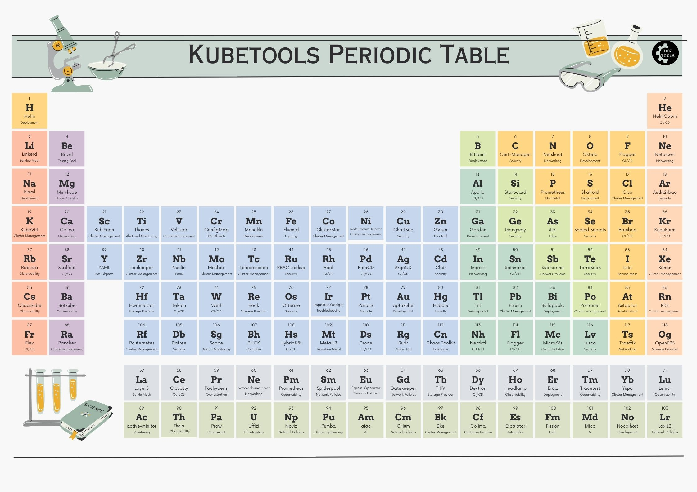

# Kubetools - A Curated List of Kubernetes Tools

 

There are more than 500+ [Kubernetes Certified Service Providers](https://www.cncf.io/certification/kcsp/) and [tons of Kubernetes Certified distributions](https://kubernetes.io/partners/). Choosing a right distribution can be a daunting task. [Kubetools](https://kubetools.io) is built with a purpose to build a curated list of popular Kubernetes tools. It is actively maintained by [Collabnix Slack Community](https://collabnix.com).  

Follow the Kubetools [Twitter](https://twitter.com/kubetools) account for updates on new list additions.

Have Questions? Join us over [Slack](https://launchpass.com/collabnix) and get chance to be a part of 10,000+ DevOps enthusiasts. 

## Top Featured Kubernetes Tools( Sep 2024)				
				
- [Krs](https://github.com/kubetoolsca/krs)
- [Kuberay](https://collabnix.com/deploying-ray-on-kubernetes/)
- [K8s-insider](https://collabnix.com/streamlining-kubernetes-networking-with-k8s-insider/)
- [Stern](https://collabnix.com/tail-kubernetes-with-stern/)
- [Node Problem Detector](https://kubetools.io/monitoring-node-health-with-node-problem-detector-in-kubernetes/)	
- [Karpenter](https://kubetools.io/supercharge-your-kubernetes-cluster-with-karpenter/)
- [Kubestalk](https://kubetools.io/kubestalk-uncovering-hidden-security-risks-in-your-kubernetes-clusters/)
- [K8sGPT](https://kubetools.io/k8sgpt-simplifying-kubernetes-diagnostics-with-natural-language-processing/)
- [Kubeshark](https://kubetools.io/mastering-kubernetes-debugging-and-troubleshooting-with-kubeshark-real-time-visibility-query-language-service-map-and-integrations/) 
- [K9s](https://kubetools.io/why-k9s-should-be-your-go-to-tool-for-kubernetes-management/)

## Table of Contents

- [Kubetools - A Curated List of Kubernetes Tools](#kubetools---a-curated-list-of-kubernetes-tools)
  - [Top Featured Kubernetes Tools( Sep 2024)](#top-featured-kubernetes-tools-sep-2024)
  - [Table of Contents](#table-of-contents)
  - [Pods](#pods)
  - [Cluster Management](#cluster-management)
  - [Cluster with Core CLI tools](#cluster-with-core-cli-tools)
  - [Alert and Monitoring](#alert-and-monitoring)
  - [Logging and Tracing](#logging-and-tracing)
  - [Troubleshooting / Debugging](#troubleshooting--debugging)
  - [Developement Tools/Kit](#developement-toolskit)
  - [Alternative Tools for Development](#alternative-tools-for-development)
  - [CI/CD integration Tools](#cicd-integration-tools)
  - [Security Tools](#security-tools)
  - [Network Policies](#network-policies)
  - [Testing Tools](#testing-tools)
  - [Service Mesh](#service-mesh)
  - [Observability](#observability)
  - [Machine Learning/Deep Learning](#machine-learningdeep-learning)
  - [Compute Edge Tools](#compute-edge-tools)
  - [Kubernetes Tools for Specific Cloud](#kubernetes-tools-for-specific-cloud)
  - [Storage Providers](#storage-providers)
  - [Backup Tools](#backup-tools)
  - [Multiple Tools Repo](#multiple-tools-repo)
  - [Cost Optimisation](#cost-optimisation)
  - [Function as a Service FaaS](#function-as-a-service-faas)
  - [Artificial Intelligence](#artificial-intelligence)
  - [Caching](#caching)
  - [Clients](#clients)
  - [Cleanup](#cleanup)
  - [Non-Categorize](#non-categorize)
  - [Maintainer](#maintainer)

## Pods

|	Sr No	|	Tool Name	|		Description with URL	|	GitHub Popularity	|
| ---------- | --------------------- | --------------------- | ------------------ |
|	1	|	kubetail 	|	[	Bash script to tail Kubernetes logs from multiple pods at the same time](https://github.com/johanhaleby/kubetail)	|		|
|	2	|	kube-s3 	|	[	Kubernetes pods used shared S3 storage](https://github.com/freegroup/kube-s3)	|		|
|	3	|	kubectl-ports-rs	|	[	A kubectl krew plugin to provide a list of exposed ports on kubernetes Pod resources](https://github.com/widnyana/kubectl-ports-rs)	|		|

## Cluster Management						
									
|	Sr No	|	Tool Name	|		Description with URL	|	GitHub Popularity	|
| ---------- | --------------------- | --------------------- | ------------------ |
|	1	|	Monokle 	|	[	Desktop unified visual tool for authoring, analysis and deployment of Kubernetes configurations](https://github.com/kubeshop/monokle)	|		|
|	2	|	kops  	|	[	Production Grade K8s Installation, Upgrades, and Management](https://github.com/kubernetes/kops)	|		|
|	3	|	silver-surfer  	|	[	Check ApiVersion compatibility and provide Migration path for Kubernetes objects when upgrading Kubernetes to latest versions](https://github.com/devtron-labs/silver-surfer)	|		|
|	4	|	Kube-ops-view  	|	[	Kubernetes Operational View - read-only system dashboard for multiple K8s clusters](https://github.com/hjacobs/kube-ops-view)	|		|
|	5	|	kubeprompt  	|	[	Kubernetes prompt info](https://github.com/jlesquembre/kubeprompt)	|		|
|	6	|	Metalk8s  	|	[	An opinionated Kubernetes distribution with a focus on long-term on-prem deployments](https://github.com/scality/metalk8s)	|		|
|	7	|	kind  	|	[	Kubernetes IN Docker - local clusters for testing Kubernetes](https://github.com/kubernetes-sigs/kind)	|		|
|	8	|	Clusterman  	|	[	Cluster Autoscaler for Kubernetes and Mesos](https://github.com/Yelp/clusterman)	|		|
|	9	|	Cert-manager  	|	[	Automatically provision and manage TLS certificates](https://github.com/jetstack/cert-manager)	|		|
|	10	|	Goldilocks  	|	[	Get your resource requests "Just Right"](https://github.com/FairwindsOps/goldilocks)	|		|
|	11	|	katafygio  	|	[	Dump, or continuously backup Kubernetes objets as yaml files in git](https://github.com/bpineau/katafygio)	|		|
|	12	|	Rancher  	|	[	Complete container management platform](https://github.com/rancher/rancher)	|		|
|	13	|	Sealed Secrets  	|	[	A Kubernetes controller and tool for one-way encrypted Secrets](https://github.com/bitnami-labs/sealed-secrets)	|		|
|	14	|	OpenKruise/Kruise  	|	[	Automate application workloads management on Kubernetes https://openkruise.io](https://github.com/openkruise/kruise)	|		|
|	15	|	kubectl snapshot  	|	[	Take Cluster Snapshots](https://github.com/fbrubbo/kubectl-snapshot)	|		|
|	16	|	kapp  	|	[	simple deployment tool focused on the concept of "Kubernetes application" — a set of resources with the same label https://get-kapp.io](https://github.com/k14s/kapp)	|		|
|	17	|	KEDA  	|	[	Event-driven autoscaler for Kubernetes](https://keda.sh/)	|		|
|	18	|	Octant  	|	[	To better understand the complexity of Kubernetes clusters](https://github.com/vmware-tanzu/octant)	|		|
|	19	|	Portainer  	|	[	Portainer inside a Kubernetes environment](https://github.com/portainer/k8s)	|		|
|	20	|	Gardener  	|	[	Deliver fully-managed clusters at scale everywhere with your own Kubernetes-as-a-Service](https://gardener.cloud/)	|	-	|
|	21	|	xlskubectl  	|	[	xlskubectl — a spreadsheet to control your Kubernetes cluster](https://github.com/learnk8s/xlskubectl)	|		|
|	22	|	Kubefirst  	|	[	Fully-automated OSS delivery & infrastructure management gitops platforms](https://github.com/kubefirst/kubefirst)	|		|
|	23	|	Kamaji  	|	[	Build and operate Kubernetes at scale with a fraction of operational burden](https://github.com/clastix/kamaji)	|		|
|	24	|	kustomizer  	|	[	An experimental package manager for distributing Kubernetes configuration as OCI artifacts](https://github.com/stefanprodan/kustomizer)	|		|
|	25	|	Kudo  	|	[	declarative approach to building production-grade Kubernetes Operators ](https://github.com/kudobuilder/kudo)	|		|
|	26	|	node-problem-detector  	|	[  This is a place for various problem detectors running on the Kubernetes nodes ](https://github.com/kubernetes/node-problem-detector)	|		|
| 27 | k0s | [k0s is an all-inclusive Kubernetes distribution, which is configured with all of the features needed to build a Kubernetes cluster and packaged as a single binary for ease of use](https://github.com/k0sproject/k0s) |  |
| 28 | k0smotron | [Deploy and run Kubernetes control planes powered by k0s on any existing cluster](https://github.com/k0sproject/k0smotron) |  |
|	29	|	ClusterPedia  	|	[	The Encyclopedia of Kubernetes clusters ](https://github.com/clusterpedia-io/clusterpedia)	|		|
|	30	|	kubean  	|	[	🌱 Kubernetes lifecycle management operator based on kubespray. ](https://github.com/kubean-io/kubean)	|		|
|	31	|	punq  	|	[	Self-hosted Kubernetes workload manager with team collaboration ](https://github.com/mogenius/punq)	|		|
|   32  |   Claudie     |   [   Deploy and operate Kubernetes clusters with each nodepool in a different provider or on-prem](https://github.com/berops/claudie)  |    |
|   33  |   Kubemarine     |   [   Management tool for Kubernetes cluster deployment and maintenance](https://github.com/Netcracker/KubeMarine)  |    |
| 34 |	k8s-duplicator | [Kubernetes controller that copies secrets into other namespaces](https://github.com/Nick-Triller/k8s-duplicator) |  |
| 35 |	KubeStellar | [a flexible solution for challenges associated with multi-cluster configuration management for edge, multi-cloud, and hybrid cloud ](https://github.com/kubestellar/kubestellar) |  |
| 36 |	Trolley | [ Trolley is a multi cloud Kubernetes management system ](https://github.com/Trolley-MGMT/trolleymgmt) |  |
| 37 |	Cyclops | [ a powerful user interface for managing and interacting with Kubernetes clusters ](https://github.com/cyclops-ui/cyclops) |  |
| 38 |	Liqo | [ an open-source project that enables dynamic and seamless Kubernetes multi-cluster topologies, supporting heterogeneous on-premise, cloud and edge infrastructures ](https://github.com/liqotech/liqo) |  |
| 39 |	Guard | [ 🔑 Kubernetes Authentication & Authorization WebHook Server ](https://github.com/kubeguard/guard) |  |	
| 40 |	Meshery | [ Meshery is a Multi-cluster management tool for Kubernetes and Clouds ](https://github.com/meshery/meshery) |  |							
| 41 |	cluster-template | [ A template for deploying a Kubernetes cluster with k3s or Talos ](https://github.com/onedr0p/cluster-template) |  |
| 42 |	vCluster | [ Create fully functional virtual Kubernetes clusters - Each vcluster runs inside a namespace of the underlying k8s cluster. It's cheaper than creating separate full-blown clusters and it offers better multi-tenancy and isolation than regular namespaces. ](https://github.com/loft-sh/vcluster) |  |
| 43 |	KindScaler | [ Node Management for KinD Clusters. Modify the KinD cluster configuration by adding or removing nodes, whether they are control-planes or workers, without regenerating it from scratch. ](https://github.com/lobuhi/kindscaler) |  |
| 44 |	buoy | [  A declarative Kubernetes dashboard in your terminal  ](https://github.com/everettraven/buoy) |  |
| 45 |	Glasskube | [  Glasskube is a Kubernetes package manager that lets you install apps via an easy-to-use web interface or CLI  ](https://github.com/glasskube/glasskube) |  |
| 46 |	Karmada | [  Open, Multi-Cloud, Multi-Cluster Kubernetes Orchestration.  ](https://github.com/karmada-io/karmada) |  |
| 47 |	Kubeadmiral | [  Multi-Cluster Kubernetes Orchestration. ](https://github.com/kubewharf/kubeadmiral) |  |
| 48 |	RBAC Wizard | [  Helps to visualize and analyze the RBAC configurations of the Kubernetes cluster. ](https://github.com/pehlicd/rbac-wizard) |  |
| 49 |	Kondense | [  Kondense is a tool designed for Kubernetes environments, specifically focused on optimizing memory and CPU usage in containers. ](https://github.com/unagex/kondense) |  |
| 50 |	Kubeseal-Webgui | [  Kubeseal-Webgui is a simple web ui for Bitnami Sealed Secrets. ](https://github.com/Jaydee94/kubeseal-webgui) |  |

## Cluster with Core CLI tools						
									
|	Sr No	|	Tool Name	|		Description with URL	|	GitHub Popularity	|
| ---------- | --------------------- | --------------------- | ------------------|									
|	1	|	Bootkube  	|	[	bootkube - Launch a self-hosted Kubernetes cluster](https://github.com/kubernetes-sigs/bootkube)	|		|
|	2	|	kubectx + kubens  	|	[	Switch faster between clusters and namespaces in kubectl](https://github.com/ahmetb/kubectx)	|		|
|	3	|	kube-shell  	|	[	Kubernetes shell: An integrated shell for working with the Kubernetes](https://github.com/cloudnativelabs/kube-shell)	|		|
|	4	|	kuttle: kubectl wrapper for sshuttle without SSH  	|	[	Kubernetes wrapper for sshuttle](https://github.com/kayrus/kuttle)	|		|
|	5	|	kubectl sudo  	|	[	Run kubernetes commands with the security privileges of another user](https://github.com/postfinance/kubectl-sudo)	|		|
|	6	|	K9s  	|	[	Kubernetes CLI To Manage Your Clusters In Style!](https://github.com/derailed/k9s)	|		|
|	7	|	Ktunnel  	|	[	A cli that exposes your local resources to kubernetes](https://github.com/omrikiei/ktunnel)	|		|
|	8	|	KubeOperator  	|	[	Run kubectl command in Web Browser. https://kubeoperator.io/](https://github.com/KubeOperator/webkubectl)	|		|
|	9	|	Vimkubectl  	|	[	Manage any Kubernetes resource from Vim https://www.vim.org/scripts/script.ph](https://github.com/rottencandy/vimkubectl)	|		|
|	10	|	KubeHelper  	|	[	KubeHelper - simplifies many daily Kubernetes cluster tasks through a web interface.](https://github.com/KubeHelper/kubehelper)	|		|
|	11	|	kubecolor  	|	[	colorizes kubectl output](https://github.com/hidetatz/kubecolor)	|		|
|	12	|	Krew  	|	[	Krew is the package manager for kubectl plugins](https://github.com/kubernetes-sigs/krew)	|		|
|	13	|	Kueue  	|	[	Kueue is a set of APIs and controller for job queueing](https://github.com/kubernetes-sigs/kueue)	|		|
|	14	|	fubectl  	|	[	Reduces repetitive interactions with kubectl](https://github.com/kubermatic/fubectl)	|		|
|	15	|	kube-ps1  	|	[	Kubernetes prompt for bash and zsh](https://github.com/jonmosco/kube-ps1)	|		|
|	16	|	Conftest  	|	[ Write tests against structured configuration data using the Open Policy Agent Rego query language](https://github.com/open-policy-agent/conftest)	|		|
|	17	|	Kube-capacity  	|	[	A  CLI that provides an overview of the resource requests, limits, and utilization in a k8s cluster](https://github.com/robscott/kube-capacity)	|		|
|	18	|	Karpenter  	|	[	Kubernetes Node Autoscaler built for flexibility, performance, and simplicity](https://github.com/aws/karpenter)	|		|
|	19	|	Autoscaler  	|	[	autoscaler Autoscaling components for Kubernetes]( https://github.com/kubernetes/autoscaler)	|		|
|	20	|	Kured  	|	[	 Kubernetes Reboot Daemon](https://github.com/kubereboot/kured)	|		|
|	21	|	Kube-prompt  	|	[	 An interactive kubernetes client featuring auto-complete](https://github.com/c-bata/kube-prompt)	|		|
|	22	|	Click  	|	[	  Command Line Interactive Controller for Kubernetes](https://github.com/databricks/click)	|		|
|	23	|	Kubie  	|	[	 A more powerful alternative to kubectx and kubens](https://github.com/sbstp/kubie)	|		|
|	24	|	Pluto  	|	[	 A cli tool to help discover deprecated apiVersions in Kubernetes](https://github.com/FairwindsOps/pluto)	|		|
|	25	|	ksync  	|	[	 Sync files between your local system and a kubernetes cluster](https://github.com/ksync/ksync)	|		|
|	26	|	fleet  	|	[	 Manage large fleets of Kubernetes clusters](https://github.com/rancher/fleet)	|		|
|	27	|	stash  	|	[	 Backup your Kubernetes Stateful Applications](https://github.com/stashed/stash)	|		|
|	28	|	Finch  	|	[	 The Finch CLI an open source client for container development](https://github.com/runfinch/finch)	|		|
|	29	|	KubeView  	|	[Kubernetes cluster visualiser and graphical explorer](https://github.com/benc-uk/kubeview)	|		|
|	30	|	Descheduler  	|	[ Descheduler for Kubernetes ](https://github.com/kubernetes-sigs/descheduler)	|		|
|	31	|	cloudtty  	|	[ A Friendly Kubernetes CloudShell (Web Terminal) ! ](https://github.com/cloudtty/cloudtty)	|		|
|	32	|	kor  	|	[ A Tool to discover unused Kubernetes Resources ](https://github.com/yonahd/kor)	|		|
|	33	|	Kubernetes Image Puller  	|	[ Caching images on a cluster by creating a DaemonSet downloading and running the container images on each node ](https://github.com/che-incubator/kubernetes-image-puller)	|		|
|	34	|	image-builder  	|	[ A tool for building Kubernetes virtual machine images across multiple infrastructure providers. ](https://github.com/kubernetes-sigs/image-builder)	|		|
|	35	|	Kubed   	|	[ Kubed with a intuitive interactive interface within Emacs help us work with our Kubernetes clusters and deployments with the full power of kubectl](https://github.com/eshelyaron/kubed)	|		|
|	36	|	Duplik8s   	|	[ Duplik8s is a kubectl plugin to duplicate resources in a Kubernetes cluster. ](https://github.com/Telemaco019/duplik8s)	|		|

## Alert and Monitoring						
									
|	Sr No	|	Tool Name	|		Description with URL	|	GitHub Popularity	|
| ---------- | --------------------- | --------------------- | ------------------|									
|	1	|	Thanos  	|	[	Highly available Prometheus setup with long term storage capabilities. CNCF Sandbox project. https://thanos.io](https://github.com/thanos-io/thanos)	|		|
|	2	|	Prometheus  	|	[	The Prometheus monitoring system and time series database.](https://github.com/prometheus/prometheus)	|		|
|	3	|	Grafana  	|	[	The tool for beautiful monitoring and metric analytics & dashboards for Graphite, InfluxDB & Prometheus & More](https://github.com/grafana/grafana)	|		|
|	4	|	Kubetail  	|	[	Bash script to tail Kubernetes logs from multiple pods at the same time](https://github.com/johanhaleby/kubetail)	|		|
|	5	|	Searchlight  	|	[	Alerts for Kubernetes](https://github.com/searchlight/searchlight)	|		|
|	6	|	linkerd2 Monitoring Mixin for Grafana  	|	[	Grafana dashboards for linkerd2 monitoring and can work in standalone (default) or in multi cluster setup](https://github.com/andrew-waters/linkerd2-mixin)	|		|
|	7	|	kuberhaus  	|	[	Kubernetes resource dashboard with node/pod layout and resource requests](https://github.com/stevelacy/kuberhaus)	|		|
|	8	|	Kubernetes Job/CronJob Notifier  	|	[	This tool sends an alert to slack whenever there is a Kubernetes cronJob/Job failure/success](https://github.com/sukeesh/k8s-job-notify)	|		|
|	9	|	Argus  	|	[	This tool monitors changes in the filesystem on specified paths](https://clustergarage.io/argus/docs/overview)	|	-	|
|	10	|	Kube-Scout  	|	[	Scout for alarming issues across your Kubernetes clusters](https://github.com/ReallyLiri/kubescout)	|		|
|	11	|	Kwatch  	|	[	monitor & detect crashes in your Kubernetes(K8s) cluster instantly](https://github.com/abahmed/kwatch)	|		|
|	12	|	Scope  	|	[	 Monitoring, visualisation & management for Docker & Kubernetes](https://github.com/weaveworks/scope)	|		|
|	13	|	Kubeshark  	|	[	TCPDump and Wireshark re-invented for Kubernetes](https://github.com/kubeshark/kubeshark)	|		|
|	14	|	Ksniff  	|	[	Kubectl plugin to ease sniffing on kubernetes pods using tcpdump and wireshark](https://github.com/eldadru/ksniff)	|		|
|	15	|	Kube-Prometheus-Top [ kptop ]  	|	[	Monitoring for Kubernetes Nodes, Pods, Containers, and PVCs resources on the terminal through Prometheus metircs](https://github.com/eslam-gomaa/kptop)	|		|
|	16	|	ktop  	|	[	A top-like tool for your Kubernetes clusters](https://github.com/vladimirvivien/ktop)	|		|
|	17	|	Kuberhealthy  	|	[A Kubernetes operator for running synthetic checks as pods. Works great with Prometheus!](https://github.com/kuberhealthy/kuberhealthy)	|		|
|	18	|	kurt  	|	[ A Kubernetes plugin that gives context to what is restarting in your Kubernetes cluster ](https://github.com/soraro/kurt)	|		|
|	19	|	KlusterView  	|	[ Get instant insights on your Kubernetes clusters with our lightweight, plug-and-play performance monitoring tool  ](https://github.com/oslabs-beta/KlusterView)	|		|
|	20	|	X.509 Certificate Exporter	|	[	Watch certificates for expiration in Kubernetes Secrets and control-plane files. Alerts and dashboard available.](https://github.com/enix/x509-certificate-exporter/)	|		|
|	21	|	VpK	|	[VpK - Visually presented Kubernetes  View k8s in graphical fashion ](https://github.com/k8svisual/vpk)	|		|
|	22	|	k8s-collector	|	[A Kubernetes Job to collect resources, logs and events from a Kubernetes cluster ](https://github.com/gianlucam76/k8s_collector)	|		|

## Logging and Tracing						
									
|	Sr No	|	Tool Name	|		Description with URL	|	GitHub Popularity	|
| ---------- | --------------------- | --------------------- | ------------------|									
|	1	|	Jaeger  	|	[	CNCF Jaeger, a Distributed Tracing Platform](https://github.com/jaegertracing/jaeger)	|		|
|	2	|	Kiali  	|	[	Kiali project, observability for the Istio service mesh](https://github.com/kiali/kiali)	|		|
|	3	|	ELK  	|	[	Elasticsearch, Logstash, Kibana](https://github.com/elastic)	|		|
|	4	|	fluentbit  	|	[	Fast and Lightweight Log processor and forwarder for Linux, BSD and OSX](https://github.com/fluent/fluent-bit)	|		|
|	5	|	Loki  	|	[	Like Prometheus, but for logs](https://github.com/grafana/loki)	|		|
|	6	| kubectl-mtail  |	[ tail logs from multiple pods matching label selector](https://gitlab.com/grzesuav/kubectl-mtail) | 
|	7	| k8spacket   |	[ packets traffic visualization for kubernetes](https://github.com/k8spacket/k8spacket) | 	
|	8	| goldpinger   |	[  Debugging tool for Kubernetes which tests and displays connectivity between nodes in the cluster](https://github.com/bloomberg/goldpinger) | 
|	9	|	Otterize network mapper  	|	[	Map Kubernetes in-cluster traffic and export as text, intents, or an image](https://github.com/otterize/network-mapper)	|		|
|	10	|	kube-audit-rest  	|	[	Kubernetes audit logging, when you don't control the control plane ](https://github.com/RichardoC/kube-audit-rest)	|		|
|	11	|	kail 	|	[	kubernetes log viewer ](https://github.com/boz/kail)	|		|
|	12	|	network mapper 	|	[	Map Kubernetes in-cluster traffic and export as text, intents, or an image ](https://github.com/otterize/network-mapper)	|		|     
|	13	|	retina	|	[	eBPF distributed networking observability tool for Kubernetes. ](https://github.com/microsoft/retina)	|		|    
|	14	|	sablier	|	[	Starting containers on demand and close automatically when not in use. ](https://github.com/acouvreur/sablier)	|		| 

## Troubleshooting / Debugging						
									
|	Sr No	|	Tool Name	|		Description with URL	|	GitHub Popularity	|
| ---------- | --------------------- | --------------------- | ------------------|									
|	1	|	Monokle  	|	[	Desktop unified visual tool for authoring, analysis and deployment of Kubernetes configurations](https://github.com/kubeshop/monokle)	|		|
|	2	|	Kubectl-debug  	|	[	Allows you to run a new container with all the troubleshooting tools installed in running pod for debugging purposed](https://github.com/aylei/kubectl-debug)	|		|
|	3	|	PowerfulSeal  	|	[	A powerful testing tool for Kubernetes clustersd](https://github.com/bloomberg/powerfulseal)	|		|
|	4	|	Crash-diagnostic  	|	[	Crash-Diagnostics is a tool to help investigate, analyze, and troubleshoot unresponsive or crashed Kubernetes clustersd](https://github.com/vmware-tanzu/crash-diagnostics)	|		|
|	5	|	K9s  	|	[	Kubernetes CLI To Manage Your Clusters In Style!d](https://github.com/derailed/k9s)	|		|
|	6	|	Kubernetes CLI Plugin - Doctor 	|	[	kubectl cluster triage plugin for k8s - 🏥 (brew doctor equivalent)d](https://github.com/emirozer/kubectl-doctor)	|		|
|	7	|	Knative Inspect  	|	[	A light-weight debugging tool for Knative's system componentsd](https://github.com/nimakaviani/knative-inspect)	|		|
|	8	|	Kubeman  	|	[	To find information from Kubernetes clusters, and to investigate issues related to Kubernetes and Istiod](https://github.com/walmartlabs/kubeman)	|		|
|	9	|	kpexec  	|	[	kpexec is a kubernetes cli that runs commands in a container with high privileges](https://github.com/ssup2/kpexec)	|		|
|	10	|	Koolkits  	|	[	🧰 Opinionated, language-specific, batteries-included debug container images for Kubernetes](https://github.com/lightrun-platform/koolkits)	|		|
|	11	|	kubespy  	|	[	pod debugging tool for kubernetes clusters with docker runtimes](https://github.com/huazhihao/kubespy)	|		|
| 12 | Inspektor Gadget | [ A collection of eBPF-based tools to debug and inspect Kubernetes resources and applications ](https://github.com/inspektor-gadget/inspektor-gadget) |  |
|	13	|	KubeSkoop  	|	[	kubernetes networking diagnose tool for different CNI plug-ins and IAAS providers](https://github.com/alibaba/kubeskoop)	|		|
|	14 |	kubent  	|	[	Easily check your clusters for use of deprecated APIs](https://github.com/doitintl/kube-no-trouble)	|		|
|	15 |	kftray  	|	[ A cross-platform system tray application for managing multiple kubectl port-forward commands, with support for UDP and proxy connections through k8s clusters ](https://github.com/hcavarsan/kftray)	|		|
|	16 |	kuttl  	|	[	Declarative approach to test Kubernetes Operators.](https://github.com/kudobuilder/kuttl)	|		|

									
## Developement Tools/Kit						
									
|	Sr No	|	Tool Name	|		Description with URL	|	GitHub Popularity	|
| ---------- | --------------------- | --------------------- | ------------------|									
|	1	|	Okteto: A Tool for Cloud Native Developers  	|	[	Build better applications by developing and testing your code directly in Kubernetes](https://github.com/okteto/okteto)	|		|
|	2	|	Tilt: Tilt manages local development instances for teams that deploy to Kubernetes  	|	[	Local Kubernetes development with no stress](https://github.com/windmilleng/tilt)	|		|
|	3	|	Garden: Kubernetes from source to finish  	|	[	Development orchestrator for Kubernetes, containers and functions.](https://github.com/garden-io/garden)	|		|
|	4	|	KuberNix  	|	[	Single dependency Kubernetes clusters for local testing, experimenting and development](https://github.com/saschagrunert/kubernix)	|		|
|	5	|	Copper  	|	[	A configuration file validator for Kubernetes](https://github.com/cloud66-oss/copper)	|		|
|	6	|	ko  	|	[	Build and deploy Go applications on Kubernetes](https://github.com/google/ko)	|		|
|	7	|	Dekorate  	|	[	Java annotation processors for Kubernetes](https://github.com/dekorateio/dekorate)	|		|
|	8	|	Lens IDE  	|	[	A powerful interface and toolkit for managing, visualizing, and interacting with multiple Kubernetes clusters](https://k8slens.dev/)	|	-	|
|	9	|	Kosko  	|	[	Organize Kubernetes manifests in JavaScript](https://kosko.dev/)	|	-	|
|	10	|	Telepresence  	|	[	Fast, local development for Kubernetes and Openshift microservices](https://www.telepresence.io/)	|	-	|
|	11	|	Monokle  	|	[	Desktop unified visual tool for authoring, analysis and deployment of Kubernetes configurations](https://github.com/kubeshop/monokle)	|		|
|	12	|	KuberEz  	|	[	Graphical modeling tool for Kubernetes manifest](https://github.com/uengine-oss/kuber-ez)	|		|
|	13	|	mirrord  	|	[	Run your local process in the context of your cloud cluster](https://github.com/metalbear-co/mirrord)	|		|
|	14	|	Aptakube  	|	[	A modern, lightweight and multi-cluster desktop client for Kubernetes](https://aptakube.com)	|	-	|
|	15	|	Kubes  	|	[	Kubernetes App Deploy Tool: build docker image, compile Kubernetes YAML files, and apply them](https://github.com/boltops-tools/kubes)	|		|
|	16	|	Kaniko  	|	[	 Build Container Images In Kubernetes](https://github.com/GoogleContainerTools/kaniko)	|		|
|	17	|	Python client for kuberenetes  	|	[	 Official Python client library for kubernetes](https://github.com/kubernetes-client/python)	    |		|
|	18	|	eclipse che IDE for k8s	|	[	 The Kubernetes-Native IDE for Developer Teams](https://github.com/eclipse/che)	    |		|
|	19	|	Kubebuilder	|	[	SDK for building Kubernetes APIs using CRDs](https://github.com/kubernetes-sigs/kubebuilder)	    |		|
|	20	|	Operator-sdk	|	[	  SDK for building Kubernetes applications. Provides high level APIs, useful abstractions, and project scaffolding](https://github.com/operator-framework/operator-sdk)	    |		|
|	21	|	cdk8s	|	[	  Kubernetes native apps and abstractions using object-oriented programming](https://github.com/cdk8s-team/cdk8s)	    |		|
|	22	|	Gitkube	|	[	 Build and deploy docker images to Kubernetes using git push](https://github.com/hasura/gitkube)	    |		|
|	23	|	Arkade	|	[	 Open Source Marketplace For Kubernetes](https://github.com/alexellis/arkade)	    |		|
|	24	|	k2tf	|	[	 k2tf - Kubernetes YAML to Terraform HCL converters](https://github.com/sl1pm4t/k2tf)	    |		|
|	25	|	Terraformer	|	[	 CLI tool to generate terraform files from existing infrastructure (reverse Terraform). Infrastructure to Code](https://github.com/GoogleCloudPlatform/terraformer)	    |		|
|	26	|	Atomix	|	[	 A Kubernetes toolkit for building distributed applications using cloud native principles](https://github.com/atomix/atomix)	    |		|
|	27	|	Brigade	|	[	  Event-driven scripting for Kubernetes](https://github.com/brigadecore/brigade)	    |		|
|	28	|	Spread	|	[	  Docker to Kubernetes in one command](https://github.com/redspread/spread)	    |		|
|	29	|	Kompose	|	[	  convert docker compose to kubernetes resources](https://github.com/kubernetes/kompose)	    |		|
|	30	|	Helmfile	|	[	 Declaratively deploy your Kubernetes manifests, Kustomize configs, and Charts as Helm releases. Generate all-in-one manifests for use with ArgoCD.](https://github.com/helmfile/helmfile)	    |		|
|	31	|	validkube	|	[    ValidKube combines the best open-source tools to help ensure Kubernetes YAML best practices, hygiene & security.]( https://github.com/komodorio/validkube)	    |		|
|	32	|	Config Syncer	|	[	 Config Syncer by AppsCode keeps ConfigMaps and Secrets synchronized across namespaces and/or clusters.](https://github.com/kubeops/config-syncer)	    |		|
|	33	|	Gefyra	|	[	 Gefyra: Blazingly-fast, rock-solid, local application development with Kubernetes](https://github.com/gefyrahq/gefyra)	    |		|
|	34	|	Kubernetes ConfigMap Reload	|	[	 Simple binary to trigger a reload when a Kubernetes ConfigMap is updated](https://github.com/jimmidyson/configmap-reload)	    |		|
|	35	|	RELOADER	|	[	 A Kubernetes controller to watch changes in ConfigMap and Secrets and do rolling upgrades on Pods](https://github.com/stakater/Reloader)	    |		|
|	36	|	Ingress Monitor Controller	|	[	 A Kubernetes controller to watch ingresses and create liveness alerts for your apps/microservices in UptimeRobot, StatusCake, Pingdom, etc](https://github.com/stakater/IngressMonitorController)	    |		|
|	37	|	odo  	|	[	 Developer-focused CLI for fast & iterative application development on Kubernetes and Podman](https://odo.dev/)	|		|
|	38	|	configmap-reload  	|	[Simple binary to trigger a reload when a Kubernetes ConfigMap is updated](https://github.com/jimmidyson/configmap-reload)	|		|
|	39	|	k8tz  	|	[Kubernetes admission controller and a CLI tool to inject timezones into Pods and CronJobs](https://github.com/k8tz/k8tz)	|		|
|	40	|	KDash  	|	[A simple and fast dashboard for Kubernetes ](https://github.com/kdash-rs/kdash)	|		|
|  41  |   DevSpace   |   [An open-source developer tool for Kubernetes that lets you develop and deploy cloud-native software faster](https://www.devspace.sh/)   |     |
|  42  |   K8Studio   |   [K8 Studio is a cross-platform client IDE to manage Kubernetes Clusters](https://github.com/guiqui/k8Studio)   |     |
|  43  |   Radius   |   [Radius is a cloud-native, portable application platform that makes app development easier for teams building cloud-native apps](https://github.com/radius-project/radius)   |     |
|  44  |   Kubefirst   |   [The Kubefirst CLI creates instant GitOps platforms that integrate some of the best tools in cloud native from scratch in minutes](https://github.com/kubefirst/kubefirst)   |     |
|  45  |   k'exp   |   [Understand Kubernetes - the visual way Not yet another attempt to manage production clusters in the browser](https://github.com/iximiuz/kexp)   |     |
|  46  |   k8s-insider   |   [A zero-config way to access you kubernetes cluster network](https://github.com/TrueGoric/k8s-insider)   |     |
|  47  |   Cyclops   |   [Developer friendly Kubernetes 👁️](https://github.com/cyclops-ui/cyclops)   |     |
|  48  |   Sablier   |   [Start your containers on demand, shut them down automatically when there's no activity. ](https://github.com/acouvreur/sablier)   |     |
|  49  |   kronic   |   [ The simple Kubernetes CronJob Admin UI ](https://github.com/mshade/kronic)   |     |
|  50  |   Kor   |   [ A Golang Tool to discover unused Kubernetes Resources ](https://github.com/yonahd/kor)   |     |
|  51  |   Docketeer   |   [ Docketeer is a developer-friendly application that provides a single interface for container and network management as well as metric visualization. ](https://github.com/open-source-labs/Docketeer)   |     |
|  52  |   Helmify   |   [ Creates Helm chart from Kubernetes yaml ](https://github.com/arttor/helmify)   |     |
|  53  |   Kueue   |   [ Kubernetes-native Job Queueing ](https://github.com/kubernetes-sigs/kueue)   |     |
|  54  |   Reckoner   |   [ Declaratively install and manage multiple Helm chart releases ](https://github.com/FairwindsOps/reckoner)   |     |
|  55  |   Katenary   |   [ Convert docker-compose to a configurable helm chart ](https://github.com/metal3d/katenary)   |     |
|  56  |   kubernetes-replicator   |   [ Kubernetes controller for synchronizing secrets & config maps across namespaces ](https://github.com/mittwald/kubernetes-replicator)   |     |
|  57  |   node-gizmo   |   [ A CLI utility for your Kubernetes nodes ](https://github.com/Kavinraja-G/node-gizmo)   |     |
|  58  |   KubeBlocks   |   [ open-source control plane that runs and manages databases, message queues and other data infrastructure on K8s. ](https://github.com/apecloud/kubeblocks)   |     |
|  59  |   KFtray   |   [ Manage and run multiple kubectl port-forward configurations directly in the menu bar, syncing configurations with git repositories. ](https://github.com/hcavarsan/kftray)   |     |
|  60  |   Tilt   |   [ Define your dev environment as code. For microservice apps on Kubernetes. ](https://github.com/tilt-dev/tilt)   |     |
|  61  |   Garden   |   [ Automation for Kubernetes development and testing. Spin up production-like environments for development, testing, and CI on demand. ](https://github.com/garden-io/garden)   |     |
|  62  |   Kubectl-fields   |   [ A Kubernetes resources hierarchy parsing tool. ](https://github.com/rewanthtammana/kubectl-fields)   |     |
|  63  |   sleepcycles   |   [ Define sleep & wake up cycles for your Kubernetes resources. ](https://github.com/rekuberate-io/sleepcycles)   |     |
|  64  |   scaf   |   [ scaf provides developers and DevOps engineers with a complete blueprint for a new project using Kubernetes . ](https://github.com/sixfeetup/scaf)   |     |
|  65  |   KubePug   |   [ Deprecations AKA KubePug - Pre UpGrade (Checker) ](https://github.com/kubepug/kubepug)   |     |
|  66  |   scaf   |   [  scaf provides developers and DevOps engineers with a complete blueprint for a new project using Kubernetes  ](https://github.com/sixfeetup/scaf)   |     |
|  67  |   mogenius   |   [  A self-service platform that enables developers to deploy and manage applications on Kubernetes with ease and safety  ](https://mogenius.com)   |   -  |
|  68  |   Armada   |   [ A multi-cluster batch queuing system for high-throughput workloads on Kubernetes. ](https://github.com/armadaproject/armada)   |     |

## Alternative Tools for Development						
									
|	Sr No	|	Tool Name	|		Description with URL	|	GitHub Popularity	|
| ---------- | --------------------- | --------------------- | ------------------|									
|	1	|	Minikube  	|	[	minikube implements a local Kubernetes clusterd](https://github.com/kubernetes/minikube)	|		|
|	2	|	KubeSphere  	|	[	Easy-to-use Production Ready Container Platform https://kubesphere.io](https://github.com/kubesphere/kubesphere)	|		|
|	3	|	skippbox  	|	[	A Desktop application for k8sd](https://github.com/skippbox/skippbox)	|		|
|	4	|	kind  	|	[	Kubernetes IN Docker - local clusters for testing Kubernetes https://kind.sigs.k8s.io/d](https://github.com/kubernetes-sigs/kind)	|		|
|	5	|	k3d  	|	[	k3d is a lightweight wrapper to run k3s (Rancher Lab’s minimal Kubernetes distribution) in docker.d](https://k3d.io/)	|	-	
|	6	|	Systemk: virtual kubelet for systemd  	|	[	Systemk is a systemd backend for the virtual-kubelet. Instead of starting containers, you start systemd units](https://github.com/virtual-kubelet/systemk)	|		|
|	7	|	mokbox  	|	[	Build verifiably conformant multi-node kubernetes clusters in containers](https://github.com/bashtools/mokctl)	|		|
|	8	|	Otomi  	|	[	Self-hosted PaaS for Kubernetes](https://github.com/redkubes/otomi-core)	|		|
|	9	|	Rainbond  	|	[	offers a serverless experience, and allows you to easily manage containerized applications without needing to understand Kubernetes](https://github.com/goodrain/rainbond)	|		|
|	10	|	MyKube  	|	[ k8s-installer - One-click k8s single-node cluster installation on your own device ](https://github.com/guyst16/mykube)	|		|

									
## CI/CD integration Tools						
									
|	Sr No	|	Tool Name	|		Description with URL	|	GitHub Popularity	|
| ---------- | --------------------- | --------------------- | ------------------|									
|	1	|	HybridK8s Droid  	|	[	Intelligence foor your favourite Delivery Platform](https://hybridk8s.tech/)	|	-	|
|	2	|	Devtron  	|	[	Software Delivery Workflow for Kubernetes](https://github.com/devtron-labs/devtron)	|		|
|	3	|	Skaffold  	|	[	Easy and Repeatable Kubernetes Development](https://github.com/GoogleContainerTools/skaffold)	|		|
|	4	|	Apollo  	|	[	Apollo - The logz.io continuous deployment solution over kubernetes](https://github.com/logzio/apollo)	|		|
|	5	|	Helm Cabin  	|	[	Web UI that visualizes Helm releases in a Kubernetes cluster](https://github.com/Nick-Triller/helm-cabin)	|		|
|	6	|	flagger  	|	[	Progressive delivery Kubernetes operator (Canary, A/B Testing and Blue/Green deployments)](https://github.com/weaveworks/flagger)	|		|
|	7	|	Kubeform  	|	[	Kubernetes CRDs for Terraform providers https://kubeform.com](https://github.com/kubeform/kubeform)	|		|
|	8	|	Spinnaker  	|	[	Spinnaker is an open source, multi-cloud continuous delivery platform for releasing software changes with high velocity and confidence. http://www.spinnaker.io/](https://github.com/spinnaker/spinnaker)	|		|
|	9	|	werf  	|	[	GitOps tool to deliver apps to Kubernetes and integrate this process with GitLab and other CI tools](https://github.com/werf/werf)	|		|
|	10	|	Flux  	|	[	GitOps Kubernetes operator](https://github.com/fluxcd/flux)	|		|
|	11	|	Argo CD  	|	[	Declarative continuous deployment for Kubernetes](https://github.com/argoproj/argo-cd)	|		|
|	12	|	Tekton  	|	[	A cloud native continuous integration and delivery (CI/CD) solution](https://github.com/tektoncd/pipeline)	|		|
|	13	|	Jenkins X  	|	[	Jenkins X provides automated CI+CD for Kubernetes with Preview Environments on Pull Requests using Tekton, Knative, Lighthouse, Skaffold and Helm](https://github.com/jenkins-x/jx)	|		|
|	14	|	Drone  	|	[	Drone is a Container-Native, Continuous Delivery Platform](https://github.com/harness/drone)	|		|
|	15	|	Helmwave  	|	[	Helmwave is helm3-native tool for deploy your Helm Charts](https://github.com/helmwave/helmwave)	|		|
|	16	|	Helmsman  	|	[ Helm Charts as Code ](https://github.com/Praqma/helmsman)	|		|
|	17	|	PipeCD  	|	[ The One CD for All {applications, platforms, operations} ](https://github.com/pipe-cd/pipecd)	|		|
|	18	|	Kluctl  	|	[ Kluctl implements templated declarative Kubernetes deployments, supporting push (CLI) and pull (kluctl-controller) based GitOps from the same source ](https://github.com/kluctl/kluctl)	|		|
| 	19 	| kubedog | [ Library to watch and follow kubernetes resources in CI/CD deploy pipelines](https://github.com/werf/kubedog) |        |
| 	20 	| Kubefirst | [ GitOps Infrastructure & Application Delivery Platform](https://github.com/kubefirst/kubefirst) |        |
| 	21	| autoapply | [ Automatically apply changes to a Kubernetes cluster](https://github.com/autoapply/autoapply) |        |

	 
## Security Tools						
									
|	Sr No	|	Tool Name	|		Description with URL	|	GitHub Popularity	|
| ---------- | --------------------- | --------------------- | ------------------|								
|	1	|	Kubevious CLI  	|	[	Prevent cross-manifest errors and violations of best practicees in YAML files, Helm Charts and Kubernetes clusters](https://github.com/kubevious/cli)	|		|
|	2	|	TerraScan  	|	[	Detect compliance and security violations across Infrastructure as Code to mitigate risk before provisioning cloud native infrastructure.](https://github.com/accurics/terrascan)	|		|
|	3	|	klum  	|	[	Kubernetes Lazy User Manager](https://github.com/ibuildthecloud/klum)	|		|
|	4	|	kube2iam  	|	[	IAM credentials to containers running inside a kubernetes cluster based on annotations.](https://github.com/jtblin/kube2iam)	|		|
|	5	|	Kyverno  	|	[	Kubernetes Native Policy Management https://kyverno.io](https://github.com/nirmata/kyverno)	|		|
|	6	|	kiosk  	|	[	kiosk office Multi-Tenancy Extension For Kubernetes - Secure Cluster Sharing & Self-Service Namespace Provisioning](https://github.com/kiosk-sh/kiosk)	|		|
|	7	|	kube-bench  	|	[	CIS Kubernetes Benchmark tool](https://github.com/aquasecurity/kube-bench)	|		|
|	8	|	kube-hunter  	|	[	Pentesting tool - Hunts for security weaknesses in Kubernetes clusters](https://github.com/aquasecurity/kube-hunter)	|		|
|	9	|	kube-who-can  	|	[	Show who has RBAC permissions to perform actions on different resources in Kubernetes](https://github.com/aquasecurity/kubectl-who-can)	|		|
|	10	|	starboard  	|	[	Kubernetes-native security toolkit](https://github.com/aquasecurity/starboard)	|		|
|	11	|	Simulator  	|	[	Kubernetes Security Training Platform - Focussing on security mitigation](https://github.com/kubernetes-simulator/simulator)	|		|
|	12	|	RBAC Lookup  	|	[	Easily find roles and cluster roles attached to any user, service account, or group name in your Kubernetes cluster https://fairwinds.com](https://github.com/FairwindsOps/rbac-lookup)	|		|
|	13	|	Kubeaudit  	|	[	kubeaudit helps you audit your Kubernetes clusters against common security controls](https://github.com/Shopify/kubeaudit)	|		|
|	14	|	Gangway  	|	[	An application that can be used to easily enable authentication flows via OIDC for a kubernetes cluster](https://github.com/heptiolabs/gangway)	|		|
|	15	|	Audit2rbac  	|	[	Autogenerate RBAC policies based on Kubernetes audit logs](https://github.com/liggitt/audit2rbac)	|		|
|	16	|	Chartsec  	|	[	Helm Chart security scanner](https://github.com/banzaicloud/chartsec)	|		|
|	17	|	kubestriker  	|	[	Security Auditing tool](https://github.com/vchinnipilli/kubestriker)	|		|
|	18	|	Datree  	|	[	CLI tool to prevent K8s misconfigurations by ensuring that manifests and Helm charts follow best practices as well as your organization’s policies](https://github.com/datreeio/datree)	|		|
|	19	|	Krane  	|	[	Kubernetes RBAC static Analysis & visualisation tool](https://github.com/appvia/krane)	|		|
|	20	|	Falco  	|	[	The Falco Project - Cloud-Native runtime security](https://falco.org/)	|	-	|
|	21	|	Clair  	|	[	Vulnerability Static Analysis for Containers](https://github.com/quay/clair)	|		|
|	22	|	M9sweeper  	|	[	Complete Kubernetes Security Platform](https://github.com/m9sweeper/m9sweeper)	|		|
|	23	|	Trivy  	|	[ Find vulnerabilities, misconfigurations, secrets, SBOM in Kubernetes](https://github.com/aquasecurity/trivy)	|		|
|	24	|	kubesec  	|	[ Security risk analysis for Kubernetes resources]( https://github.com/controlplaneio/kubesec)	|		|
|	25	|	Vault-k8s  	|	[ First-class support for Vault and Kubernetes](https://github.com/hashicorp/vault-k8s)	|		|
|	26	|	Hardeneks  	|	[  Runs checks to see if an EKS cluster follows EKS Best Practices.](https://github.com/aws-samples/hardeneks)	|		|
|	27	|	Hubble  	|	[ Network, Service & Security Observability for Kubernetes using eBPF]( https://github.com/cilium/hubble)	|		|
|	28	|	Kubeval  	|	[ Validate your Kubernetes configuration files, supports multiple Kubernetes versions](https://github.com/instrumenta/kubeval)	|		|
| 	29 	| Paralus | [ Paralus enables controlled, audited access to Kubernetes infrastructure and Zero trust Kubernetes with zero friction.](https://github.com/paralus/paralus) |  |
| 	30 	| Peirates | [ Kubernetes Penetration Testing tool](https://github.com/inguardians/peirates) |     |
| 	31 	| Kubectl-kubesec | [ Security risk analysis for Kubernetes resources](https://github.com/controlplaneio/kubectl-kubesec) |       |
| 	32 	| jsPolicy | [ jsPolicy is a policy engine for Kubernetes that allows you to write policies in JavaScript or TypeScript](https://github.com/pavan-kumar-99/medium-manifests/tree/jsPolicy) |  -      |
| 	33 	| Netchecks | [ Set of tools for testing network conditions and asserting that they are as expected.](https://github.com/hardbyte/netchecks/) |        |
| 	34 	| KubeLinter | [ KubeLinter is a static analysis tool that checks Kubernetes YAML files and Helm charts to ensure the applications represented in them adhere to best practices](https://github.com/stackrox/kube-linter) |        |
| 	35 	| IceKube | [ IceKube is a tool to help find attack paths within a Kubernetes cluster from a low privileged point, to a preferred location, typically cluster-admin](https://github.com/WithSecureLabs/IceKube) |        |
|	36	|	kube-rebac-authorizer  	|	[	Beyond RBAC: Implementing Relation-based Access Control for Kubernetes with OpenFGA ](https://github.com/luxas/kube-rebac-authorizer)	|		|
|	37	|	MTKPI  	|	[	 🧰 Multi Tool Kubernetes Pentest Image ](https://github.com/r0binak/MTKPI)	|		|
|	38	|	KubeZoo  	|	[	 a lightweight kubernetes multi-tenancy gateway ](https://github.com/kubewharf/kubezoo)	|		|
|	39	|	kubectl-modify-secrets   	|	[	 allows user to directly modify the secret without worrying about base64 encoding/decoding ](https://github.com/rajatjindal/kubectl-modify-secret)	|		|
|	40	|	rbac-tool  	|	[	 Rapid7  insightCloudSec  Kubernetes RBAC Power Toys - Visualize, Analyze, Generate & Query ](https://github.com/alcideio/rbac-tool)	|		|
|	41	|	KubeClarity  	|	[	 KubeClarity is a tool for detection and management of Software Bill Of Materials (SBOM) and vulnerabilities of container images and filesystems. ](https://github.com/openclarity/kubeclarity)	|		|
|	42	|	MKAT  	|	[ All-in-one auditing toolkit for identifying common security issues in managed Kubernetes environments. Currently supports Amazon EKS ](https://github.com/DataDog/managed-kubernetes-auditing-toolkit)	|		|
|	43	|	Kubescape  	|	[ Kubernetes security platform for configuration scanning, risk analysis, and runtime protection. CNCF project that includes policy enforcement, vulnerability scanning, and RBAC visualizer ](https://github.com/kubescape/kubescape)	|		|

## Network Policies						
									
|	Sr No	|	Tool Name	|		Description with URL	|	GitHub Popularity	|
| ---------- | --------------------- | --------------------- | ------------------|									
|	1	|	Calico  	|	[	Cloud native connectivity and network policy](https://github.com/projectcalico/calico)	|		|
|	2	|	kokotap  	|	[	Tools for kubernetes pod network tapping](https://github.com/redhat-nfvpe/kokotap)	|		|
|	3	|	Submariner  	|	[	Connect all your Kubernetes clusters, no matter where they are in the world](https://github.com/submariner-io/submariner)	|		|
|	4	|	egress-operator  	|	[	An operator to produce egress gateway pods and control access to them with network policies](https://github.com/monzo/egress-operator)	|		|
|	5	|	kubefwd (Kube Forward)  	|	[	Bulk port forwarding Kubernetes services for local development](https://github.com/txn2/kubefwd)	|		|
|	6	|	Kilo (k8s + wg)	|	[	A multi-cloud network overlay built on WireGuard and designed for Kubernetes](https://github.com/squat/kilo)	|		|	
|	7	|	Cilium	|	[	eBPF-based Networking, Security, and Observability ](https://github.com/cilium/cilium)	|		 |
| 8 | MetalLB | [MetalLB is a load-balancer implementation for bare metal Kubernetes clusters, using standard routing protocols](https://github.com/metallb/metallb) |  |
|	9	|	Spiderpool	|	[	underlay network solution of cloud native, for bare metal, VM and public cloud ](https://github.com/spidernet-io/spiderpool)	|		 |
|	10	|	LoxiLB	|	[	eBPF based cloud-native load-balancer. Powering K8s,Edge,5G,IoT,XaaS Apps ](https://github.com/loxilb-io/loxilb)	|		 |
|	11	|	submariner	|	[	Networking component for interconnecting Pods and Services across Kubernetes clusters ](https://github.com/submariner-io/submariner)	|		 |
|	12	|	netfetch	|	[	Scan k8s clusters for network policies and identifying unprotected workloads. ](https://github.com/deggja/netfetch)	|		 |
|	13	|	Network Policy API	|	[	A further work involving Kubernetes network security beyond the NetworkPolicy v1 resource. ](https://github.com/kubernetes-sigs/network-policy-api)	|		 |
|	14	|	KubeIP	|	[ Assign static public IPs to Kubernetes nodes (GKE, EKS) ](https://github.com/doitintl/kubeip)	|		 |

									
## Testing Tools						
									
|	Sr No	|	Tool Name	|		Description with URL	|	GitHub Popularity	|
| ---------- | --------------------- | --------------------- | ------------------|									
|	1	|	Testkube  	|	[	Kubernetes-native testing framework for testers and developers](https://github.com/kubeshop/testkube)	|		|
|	2	|	k6d  	|	[	A modern load testing tool, using Go and JavaScript](https://github.com/loadimpact/k6)	|		|
|	3	|	Network bandwith and load testingd - 	|	[	Test suite for Kubernetes](https://github.com/mrahbar/k8s-testsuite)	|		|
|	4	|	test-infrad  	|	[	Test infrastructure for the Kubernetes project](https://github.com/kubernetes/test-infra)	|		|
|	5	|	kube-scored  	|	[	Kubernetes object analysis with recommendations for improved reliability and security](https://github.com/zegl/kube-score)	|		|
|	6	|	Litmusd  	|	[	Cloud-Native Chaos Engineering; Kubernetes-Native Chaos Engineering; Chaos Engineering for Kubernetes](https://github.com/litmuschaos/litmus)	|		|
|	7	|	PowerfulSeald  	|	[	A powerful testing tool for Kubernetes clusters](https://github.com/bloomberg/powerfulseal)	|		|
|	8	|	kube-burnerd  	|	[	Kube-burner is a tool aimed at stressing kubernetes clusters](https://kube-burner.readthedocs.io/en/latest/)	|	-	|
|	9	|	Tracetest  	|	[	Generate end-to-end and integration tests automatically from your OpenTelemetry traces](https://github.com/kubeshop/tracetest)	|		|
|	10	|	Microcks  	|	[	 Kubernetes native tool for mocking and testing API and micro-services](https://github.com/microcks/microcks)	|		|
|	11	|	KWOK  	        |	[	Kubernetes WithOut Kubelet - Simulates thousands of Nodes and Clusters.](https://github.com/kubernetes-sigs/kwok)	|		|
|	12	|	Keploy  	|	[	Open source Tool for converting user-traffic to Test Cases and Data Stubs.](https://github.com/keploy/keploy)	|		|
|	13	|	Netchecks  	|	[Tool to validate assumptions about the network](https://github.com/hardbyte/netchecks)	|		|
|       14      |	Nighthawk       | [ Nighthawk is Layer5's versatile HTTP load tester. Drills deep with constant & adaptive rates, revealing performance insights ](https://github.com/layer5io/getnighthawk) |  |
|      15       |	perf-tests      | [ Performance tests and benchmarks ](https://github.com/kubernetes/perf-tests) |  |

			     
## Service Mesh						
									
|	Sr No	|	Tool Name	|		Description with URL	|	GitHub Popularity	|
| ---------- | --------------------- | --------------------- | ------------------|									
|	1	|	Istio  	|	[	Connect, secure, control, and observe services](https://github.com/istio/istio)	|		|
|	2	|	Traefik  	|	[	The Cloud Native Edge Router](https://github.com/containous/traefik)	|		|
|	3	|	NGINX Ingress Controller  	|	[	NGINX and NGINX Plus Ingress Controllers for Kubernetes](https://github.com/nginxinc/kubernetes-ingress)	|		|
|	4	|	Autopilot  	|	[	THE SERVICE MESH SDK](https://docs.solo.io/autopilot/latest)	|	-	|
|	5	|	linkerd-config  	|	[	A Kubernetes controller that knows how to reconcile the Linkerd configuration](https://github.com/ihcsim/linkerd-config)	|		|
|	6	|	Kong  	|	[	Kong for Kubernetes: the official Ingress Controller for Kubernetes](https://github.com/Kong/kubernetes-ingress-controller)	|		|
|	7	|	OSM 	|	[	Open Service Mesh (OSM) is a lightweight, extensible, cloud native service mesh](https://github.com/openservicemesh/osm)	|		|
|	8	|	Gloo Mesh  	|	[	The Service Mesh Orchestration Platform](https://github.com/solo-io/gloo-mesh)	|		|
|	9	|	APISIX 	|	[	Apache APISIX is a dynamic, real-time, high-performance API gateway.](https://github.com/apache/apisix)	|		|
|	10	|	Contour  	|	[	High performance ingress controller for Kubernetes](https://projectcontour.io/)	|	-	|
|	11	|	Kusk Gateway  	|	[	OpenAPI-driven Ingress Controller for Kubernetes](https://kusk.io/kusk-gateway)	|	-	|
|	12	|	MerBridge  	|	[	Use eBPF to speed up your Service Mesh like crossing an Einstein-Rosen Bridge.](https://github.com/merbridge/merbridge)	|		|
									
									
## Observability						
									
|	Sr No	|	Tool Name	|		Description with URL	|	GitHub Popularity	|
| ---------- | --------------------- | --------------------- | ------------------|									
|	1	|	Kubespy  	|	[	Tools for observing Kubernetes resources in real time](https://github.com/pulumi/kubespy)	|		|
|	2	|	Popeye  	|	[	A Kubernetes cluster resource sanitizer](https://github.com/derailed/popeye)	|		|
|	3	|	Stern  	|	[	Multi pod and container log tailing for Kubernetes](https://github.com/stern/stern)	|		|
|	4	|	Cri-tools  	|	[	CLI and validation tools for Kubelet Container Runtime Interface (CRI)](https://github.com/kubernetes-sigs/cri-tools)	|		|
|	5	|	Kubebox  	|	[	Terminal and Web console for Kubernetes](https://github.com/astefanutti/kubebox)	|		|
|	6	|	Kubewatch  	|	[	Watch k8s events and trigger Handlers](https://github.com/bitnami-labs/kubewatch)	|		|
|	7	|	kube-state-metrics  	|	[	Add-on agent to generate and expose cluster-level metrics](https://github.com/kubernetes/kube-state-metrics)	|		|
|	8	|	Sloop  	|	[	Kubernetes History Visualization](https://github.com/salesforce/sloop?utm_sq=g90yo8t8s1)	|		|
|	9	|	kubectl tree 🎄  	|	[	Kubectl plugin to observe object hierarchies through ownerReferences](https://github.com/ahmetb/kubectl-tree)	|		|
|	10	|	chaoskube  	|	[	chaoskube periodically kills random pods in your Kubernetes cluster](https://github.com/linki/chaoskube)	|		|
|	11	|	BotKube  	|	[	Helps you monitor your Kubernetes cluster(s), debug critical deployments and gives recommendations for standard practices](https://www.botkube.io/)	|	-	|
|	12	|	Kubestone  	|	[	Kubestone is a benchmarking Operator that can evaluate the performance of Kubernetes installations](https://kubestone.io/en/latest)	|	-	|
|	13	|	Chaos Mesh  	|	[	A Chaos Engineering Platform for Kubernetes](https://github.com/pingcap/chaos-mesh)	|		|
|	14	|	Lemur  	|	[	LEMUR: Observability and Context](https://github.com/turbonomic/lemur)	|		|
|	15	|	kubernetes-event-exporter  	|	[	Export Kubernetes events to multiple destinations with routing and filtering](https://github.com/opsgenie/kubernetes-event-exporter)	|		|
|	16	|	Kubevious  	|	[	Kubevious is an app-centric assurance, validation, and introspection platform for Kubernetes](https://kubevious.io/)	|	-	|
|	17	|	OpenTelemetry  	|	[	High-quality, ubiquitous, and portable telemetry to enable effective observability](https://opentelemetry.io/)	|	-	|
|	18	|	Grafana Tempo  	|	[	Grafana Tempo is a high volume, minimal dependency distributed tracing backend](https://github.com/grafana/tempo)	|		|
|	19	|	Tracetest 	|	[	Generate end-to-end and integration tests automatically from your OpenTelemetry traces](https://github.com/kubeshop/tracetest)	|		|
|	20	|	Pumba  	|	[	Chaos testing, network emulation, and stress testing tool for containers](https://github.com/alexei-led/pumba)	|		|
|	21	|	Robusta  	|	[	Kubernetes observability and automation, with an awesome Prometheus integration](https://github.com/robusta-dev/robusta)	|		|
|	22	|	kubeinvaders  	|	[	Gamified Chaos Engineering Tool for Kubernetes](https://github.com/lucky-sideburn/kubeinvaders)	|		|
 |	23	|	Headlamp  	|	[	An easy-to-use and extensible web UI for Kubernetes](https://github.com/headlamp-k8s/headlamp)	|		|
 |	24	|	Pixie  	|	[	Instant Kubernetes-Native Application Observability.  ](https://github.com/pixie-io/pixie)	|		|

## Machine Learning/Deep Learning						
									
|	Sr No	|	Tool Name	|		Description with URL	|	GitHub Popularity	|
| ---------- | --------------------- | --------------------- | ------------------|									
|	1	|	Nos  	|	[	nos is an open-source platform to efficiently run AI workloads on Kubernetes, increasing GPU utilization and reducing infrastructure and operational costs](https://github.com/nebuly-ai/nos)	|		|
|	2	|	Kubeflow  	|	[	Machine Learning Toolkit for Kubernetes](https://github.com/kubeflow/kubeflow)	|		|
|	3	|	Volcano  	|	[	A Kubernetes Native Batch System](https://github.com/volcano-sh/volcano)	|		|
									
									
## Compute Edge Tools						
									
|	Sr No	|	Tool Name	|		Description with URL	|	GitHub Popularity	|
| ---------- | --------------------- | --------------------- | ------------------|									
|	1	|	KubeEdge 	|	[	Kubernetes Native Edge Computing Framework](https://github.com/kubeedge/kubeedge)	|		|
|	2	|	OpenYurt  	|	[	Extending your native Kubernetes to edge](https://github.com/openyurtio/openyurt)	|		|
|	3	|	Akri  	|	[	A Kubernetes Resource Interface for the Edge](https://github.com/project-akri/akri)	|		|
|	4	|	SuperEdge  	|	[	An edge-native container management system for edge computing](https://github.com/superedge/superedge)	|		|
|	5	|	Keylime  	|	[	A CNCF Project to Bootstrap & Maintain Trust on the Edge / Cloud and IoT](https://github.com/keylime/keylime)	|		|
|	6	|	Microk8s  	|	[	A small, fast, single-package Kubernetes for developers, IoT and edge](https://github.com/canonical/microk8s)	|		|
|	7	|	Shifu  	|	[	 Kubernetes native IoT software development framework](https://github.com/Edgenesis/shifu)	|		|
|	8	|	kairos  	|	[	The immutable Linux meta-distribution for edge Kubernetes](https://github.com/kairos-io/kairos)	|		|

									
 									
## Kubernetes Tools for Specific Cloud						
									
|	Sr No	|	Tool Name	|		Description with URL	|	GitHub Popularity	|
| ---------- | --------------------- | --------------------- | ------------------|									
|	1	|	Kubernetes on AWS (kube-aws)  	|	[	A command-line tool to declaratively manage Kubernetes clusters on AWS](https://github.com/kubernetes-incubator/kube-aws)	|		|
|	2	|	Draft: Streamlined Kubernetes Development  	|	[	A tool for developers to create cloud-native applications on Kubernetes](https://github.com/azure/draft)	|		|
|	3	|	helm-ssm  	|	[	A low dependency tool for retrieving and injecting secrets from AWS SSM into Helm](https://github.com/totango/helm-ssm)	|		|
|	4	|	Skupper  	|	[	Multicloud communication for Kubernetes](https://skupper.io/)	|	-	|
|	5	|	AWS workshop for kubernetes  	|	[	AWS workshop for kubernetes](https://github.com/aws-samples/aws-workshop-for-kubernetes)	|		|
|	6	|	Sealos  	|	[  A Kubernetes distribution, a general-purpose Cloud Operating System designed for managing cloud-native applications](https://github.com/labring/sealos)	|		|
|	7	|	Porter  	|	[   Kubernetes-powered PaaS that runs in your own cloud.](https://github.com/porter-dev/porter)	|		|
|	8	|	Kubicorn  	|	[   Create, manage, snapshot, and scale Kubernetes infrastructure in the public cloud](https://github.com/kubicorn/kubicorn)	|		|
|	9	|	eksdemo  	|	[ The easy button for learning, testing and demoing Amazon EKS  ](https://github.com/awslabs/eksdemo)	|		|
|	10	|	Claudie   	|	[ Claudie allows users to manage Kubernetes clusters that span across multiple cloud providers and on-premise infrastructures  ](https://github.com/berops/claudie)	|		|
 							
									
## Storage Providers						
									
|	Sr No	|	Tool Name	|		Description with URL	|	GitHub Popularity	|
| ---------- | --------------------- | --------------------- | ------------------|									
|	1	|	ChubaoFS  	|	[	distributed file system and object storage](https://github.com/chubaofs/chubaofs)	|		|
|	2	|	Longhorn 	|	[	Cloud-Native distributed block storage built on and for Kubernetes](https://github.com/longhorn/longhorn)	|		|
|	3	|	OpenEBS  	|	[	Kubernetes native - hyperconverged block storage with multiple storage engines](https://github.com/openebs/openebs)	|		|
|	4	|	Rook  	|	[	Storage Orchestration for Kubernetes](https://github.com/rook/rook)	|		|
|	5	|	SeaweedFS  	|	[	Distributed file system supports read-write many volumes](https://github.com/chrislusf/seaweedfs)	|		|
|	6	|	TiKV  	|	[	Distributed transactional key-value database](https://github.com/tikv/tikv)	|		|
|	7	|	TopoLVM  	|	[	Capacity-aware CSI plugin for Kubernetes](https://github.com/topolvm/topolvm)	|		|
|	8	|	velero  	|	[	Backup and migrate Kubernetes applications and their persistent volumes](https://github.com/vmware-tanzu/velero)	|		|
|	9	|	Vitess  	|	[	Vitess is a database clustering system for horizontal scaling of MySQL](https://github.com/vitessio/vitess)	|		|
|	10	|	kaDalu  	|	[	A lightweight Persistent storage solution for Kubernetes / OpenShift using GlusterFS in background](https://github.com/kadalu/kadalu)	|		|
|	11	|	hwameistor  	|	[	Hwameistor is an HA local storage system for cloud-native stateful workloads.](https://github.com/hwameistor/hwameistor)	|		|
|	11	|	simplyblock 	|	[	Simplyblock is a distributed block storage engine for Kubernetes persistent volumes](https://www.simplyblock.io/kubernetes-storage)	|	-	|
|	12	|	Veritas infoscale 	|	[	Manage critical data and applications in Kubernetes environments.](https://www.veritas.com/availability/infoscale-kubernetes)	|	-	|

									

## Backup Tools
									
|	Sr No	|	Tool Name	|		Description with URL	|	GitHub Popularity	|
| ---------- | ---------------------    | --------------------- | ------------------|	
|     1      |   Stash               |  [	🛅 Backup your Kubernetes Stateful Applications](https://github.com/stashed/stash)  |	 
|     2      |   kube-dump              |  [	Backup a Kubernetes cluster as a yaml manifest](https://github.com/WoozyMasta/kube-dump)  |	 
|     3      |   VolSync             |  [	Asynchronous data replication for Kubernetes volumes](https://github.com/backube/volsync)  |	 
|     4     |   Reflector             |  [	Custom Kubernetes controller that can be used to replicate secrets, configmaps and certificates.](https://github.com/emberstack/kubernetes-reflector)  |	 
|     5      |   SnapScheduler          |  [	Scheduled snapshots for Kubernetes persistent volumes.](https://github.com/backube/snapscheduler)  |	 |
|     6      |   K8up Backup Operator           |  [	K8up is a Kubernetes backup operator based on Restic that will handle PVC and application backups on a Kubernetes or OpenShift cluster](https://github.com/k8up-io/k8up)  |	 

  
## Multiple Tools Repo						
									
|	Sr No	|	Tool Name	|		Description with URL	|	GitHub Popularity	|
| ---------- | --------------------- | --------------------- | ------------------|									
|	1	|	Chaos Toolkit Kubernetes Support  	|	[	Kubernetes driver extension of the Chaos Toolkit probes and actions API](https://github.com/chaostoolkit/chaostoolkit-kubernetes)	|		|
|	2	|	k14s  	|	[	Kubernetes Tools that follow Unix philosophy to be simple and composable](https://github.com/k14s)	|		|
|	3	|	Pulumi  	|	[	Pulumi - Modern Infrastructure as Code. Any cloud, any language. Give your team cloud superpowers rocket https://www.pulumi.com](https://github.com/pulumi/pulumi)	|		|
|	4	|	Gvisor  	|	[	Application Kernel for Containers](https://github.com/google/gvisor)	|		|
|	5	|	Colima  	|	[	 Container runtimes on macOS (and Linux) with minimal setup](https://github.com/abiosoft/colima)	|		|
|	6	|	Krateo Platformops 	|	[	 Open source platform to manage infrastructure, resources and applications via YAML files](https://github.com/krateoplatformops/krateo)	|		|
|	7	|	Kamus 	|	[	 An open source, git-ops, zero-trust secret encryption and decryption solution for Kubernetes applications](https://github.com/Soluto/kamus)	|		|
 |	8	|	korb 	|	[	 Move Kubernetes PVCs between Storage Classes and Namespaces](https://github.com/BeryJu/korb)	|		|																

## Cost Optimisation						
									
|	Sr No	|	Tool Name	|		Description with URL	|	GitHub Popularity	|
| ---------- | --------------------- | --------------------- | ------------------|									
|	1	|	Kubecost  	|	[	Cross-cloud cost allocation models for workloads running on Kubernetes](https://github.com/kubecost/cost-model)	|		|
|	2	|	PerfectScale  	|	[	Reduce Kubernetes costs while improving performance and resilience with data-driven intelligence built for continuous optimization](https://www.perfectscale.io)	|	-	|
|	3	|	OpenCost  	|	[	OpenCost — your favorite open source cost monitoring tool for Kubernetes](https://github.com/opencost/opencost)	|		|
| 4 | kube-green | [kube-green is a simple k8s addon that automatically shuts down (some of) your resources when you don't need them](https://github.com/kube-green/kube-green) |  |
| 5 | kepler | [Kepler (Kubernetes-based Efficient Power Level Exporter) uses eBPF to probe performance counters and other system stats, use ML models to estimate workload energy consumption based on these stats, and exports them as Prometheus metrics](https://github/stars/sustainable-computing-io/kepler) |  |
| 6 | KBOM | [ KBOM - Kubernetes Bill of Materials ](https://github.com/rad-security/kbom) |  |
| 7 | StormForge | [ Autonomous Rightsizing for Kubernetes Workloads ](https://stormforge.io) | - |

	
## Function as a Service FaaS			
									
|	Sr No	|	Tool Name	|		Description with URL	|	GitHub Popularity	|
| ---------- | --------------------- | --------------------- | ------------------|									
|	1	|    Knative Serving	|	[	Kubernetes-based, scale-to-zero, request-driven compute ](https://github.com/knative/serving)	|		|
|	2	|	OpenFaaS  	|	[	OpenFaaS - Serverless Functions Made Simple](https://github.com/openfaas/faas)	|		|
|	3	|	Kubeless  	|	[   Kubernetes Native Serverless Framework](https://github.com/vmware-archive/kubeless)	|		|									
|	4	|    Fission	|	[	Fast and Simple Serverless Functions for Kubernetes ](https://github.com/fission/fission)	|		|
|	5	|    Nuclio	|	[ High-Performance Serverless event and data processing platform ](https://github.com/nuclio/nuclio)	|		|
|	6	|  Apache OpenServerless	|	[ Serverless environment based on Apache OpenWhisk with lots of integrated services ](https://github.com/apache/openserverless)	|		|

## Artificial Intelligence

|	Sr No	|	Tool Name	|		Description with URL	|	GitHub Popularity	|
| ---------- | --------------------- | --------------------- | ------------------|									
|	1	|    	k8sgpt |	[	Giving Kubernetes SRE superpowers to everyone ](https://github.com/k8sgpt-ai/k8sgpt)	|		|
|	2	|    	kubectl-ai |	[	Kubectl plugin for OpenAI GPT ](https://github.com/sozercan/kubectl-ai)	|		|
|	3	|    	kopilot |	[	Your AI Kubernetes Expert ](https://github.com/knight42/kopilot)	|		|
|	4	|    	kopylot |	[	An AI-Powered assistant for Kubernetes developers ](https://github.com/avsthiago/kopylot)	|		|
|	5	|	aiac  	|	[	Artificial Intelligence K8s manifest and package generator](https://github.com/gofireflyio/aiac)	|		|
|	6	|	mico  	|	[	An AI assisted kubectl helper](https://github.com/tahtaciburak/mico)	|		|
|	7	|	kserve  	|	[ Standardized Serverless ML Inference Platform on Kubernets](https://github.com/kserve/kserve)	|	|
|	8	|    	 kubectl-assistant |	[	This tool uses OpenAI's GPT3 API to generate Kubernetes kubectl commands to run against a cluster ](https://github.com/dkoshkin/kubectl-assistant)	|		|
|	9	|    	 HolmesGPT |	[	The only DevOps assistant that solves alerts like a human does - by looking at alerts and fetching missing data repeatedly until the alert can be solved ](https://github.com/robusta-dev/holmesgpt)	|		|

## Caching

|	Sr No	|	Tool Name	|		Description with URL	|	GitHub Popularity	|
| ---------- | --------------------- | --------------------- | ------------------|									
|	1	|    	kube-fledged |	[ A kubernetes operator for creating and managing a cache of container images directly on the cluster worker nodes ](https://github.com/senthilrch/kube-fledged)	|		|
|	2	|    	kubernetes-image-puller |	[ It is used for caching images on a cluster. It creates a DaemonSet downloading and running the relevant container images on each node. ](https://github.com/che-incubator/kubernetes-image-puller)	|		|
|	3	|    	Tugger |	[ Kubernetes Admission Webhook to enforce pulling of Docker images from the private registry. ](https://github.com/jainishshah17/tugger)	|		|
|	4	|    	kube-image-keeper (kuik) |	[ kuik is a container image caching system for Kubernetes](https://github.com/enix/kube-image-keeper)	|		|
|	5	|    	harbor |	[	A trusted cloud native registry project that stores,caches, signs, and scans content. ](https://github.com/goharbor/harbor)	|		|
|	6	|    	kuik |	[ kuik is a container image caching system for Kubernetes ](https://github.com/enix/kube-image-keeper)	|		|

## Clients

|	Sr No	|	Tool Name	|		Description with URL	|	GitHub Popularity	|
| ---------- | --------------------- | --------------------- | ------------------|									
|	1	|     Go Client for Kubernetes |	[ Official Golang client library for kubernetes ](https://github.com/kubernetes-client/go)	|		|
|	2	|     Python Client for Kubernetes |	[ Official Python client library for kubernetes ](https://github.com/kubernetes-client/python)	|		|
|	3	|     Java Client for Kubernetes |	[ Official Java client library for kubernetes ](https://github.com/kubernetes-client/java)	|		|
|	4	|     Javascript Client for Kubernetes |	[ Official Javascript client library for kubernetes ](https://github.com/kubernetes-client/javascript)	|		|
|	5	|     csharp Client for Kubernetes |	[ Official dotnet client library for kubernetes ](https://github.com/kubernetes-client/csharp)	|		|
|	6	|     Dapr |	[  Dapr is a portable, event-driven, runtime for building distributed applications across cloud and edge ](https://github.com/dapr/dapr)	|		|
|	7	|     DevPod |	[  client-only tool to create reproducible developer environments based on a devcontainer.json on any backend ](https://github.com/loft-sh/devpod)	|		|

## Cleanup

|	Sr No	|	Tool Name	|		Description with URL	|	GitHub Popularity	|
| ---------- | --------------------- | --------------------- | ------------------|									
|	1	|	kube-fencing  	|	[cleaning resources from the failed nodes that's blocks any further operation and recovery](https://github.com/kvaps/kube-fencing)	|		|
| 2 | k8s-cleaner | [Cleaner is a Kubernetes controller that helps you maintain a clean and efficient Kubernetes environment by proactively identifying, removing, or updating stale resources](https://github.com/gianlucam76/k8s-cleaner) |  |
|  3  |   CRI-Purge   |   [CRI Purge - Cleanup of Cached Kubernetes CRI Images](https://github.com/reefland/cri-purge)   |     |
|  4  |   Pred8tor   |   [ Pred8tor is a simple tool to clean up K8s objects that were tagged for expiration ](https://github.com/pavelzag/pred8tor)   |     |
|  5  |   Kubetrim   |   [ Kubetrim is a command-line tool designed to automatically clean up your Kubernetes configuration file (KUBECONFIG) ](https://github.com/alexellis/kubetrim)   |     |

## Non-Categorize						
									
|	Sr No	|	Tool Name	|		Description with URL	|	GitHub Popularity	|
| ---------- | --------------------- | --------------------- | ------------------|									
|	1	|	Rudr  	|	[	A Kubernetes implementation of the Open Application Model specification](https://github.com/oam-dev/rudr)	|		|
|	2	|	Keel 	|	[	Kubernetes Operator to automate Helm, DaemonSet, StatefulSet & Deployment updates](https://keel.sh/)	|	-	|
|	3	|	Cabin, the mobile app for Kubernetes - 	|	[	The Mobile Dashboard for Kubernetes](https://github.com/bitnami-labs/cabin)	|		|
|	4	|	Funktion 	|	[	CLI tool for working with funktion](https://github.com/funktionio/funktion)	|		|
|	5	|	Alterant  	|	[	A simple Kubernetes configuration modifier](https://github.com/cloud66-oss/alterant)	|		|
|	6	|	BUCK  	|	[	Brigade Universal Controller for Kubernetes](https://github.com/brigadecore/buck)	|		|
|	7	|	kube-fledged  	|	[	A kubernetes add-on for creating and managing a cache of container images directly on the cluster worker nodes, so application pods start almost instantly](https://github.com/senthilrch/kube-fledged)	|		|
|	8	|	kpt  	|	[	toolkit to help you manage, manipulate, customize, and apply Kubernetes Resource configuration](https://github.com/GoogleContainerTools/kpt)	|		|
|	9	|	capsule  	|	[	Capsule helps to implement a multi-tenancy and policy-based environment in your Kubernetes cluster](https://github.com/clastix/capsule)	|		|
|	10	|	KubeSlice  	|	[	KubeSlice enables Kubernetes pods and services to communicate seamlessly across clusters, clouds, edges, and data centers by creating logical application boundaries known as Slices](https://github.com/kubeslice)	|		|
|	11	|	routernetes 	|	[	Use Kubernetes to make a home router!](https://github.com/routernetes/routernetes)	|		|
|	12	|	Symbiosis 	|	[	Symbiosis is a cloud service provider optimized for Kubernetes. Launch clusters in <2 min with better tools and lower costs](https://symbiosis.host/)	|	-	|
|	13	|	Projectsveltos 	|	[	Kubernetes add-on controller for hundreds of clusters that automatically discovers and classifies clusters, making it easy to manage add-ons at scale](https://github.com/projectsveltos/addon-controller)	|		|
| 14 | MayFly | [Mayfly is a Kubernetes operator that enables you to create temporary resources on the cluster that will expire after a certain period of time](https://github.com/NCCloud/mayfly) |  |
|       15      |       yupd            |       [       Yupd is a command-line tool that allows updating YAML files the GitOps way](https://github.com/srozange/yupd)   |    |
|	16	|	kube-job  	|	[	Run one off job on kubernetes from the command line tool](https://github.com/h3poteto/kube-job)	|		|
|	17	|	paster  	|	[	This program base64 encodes a file, then pastes chunks it into an activated window using 'Ctrl+V' in the pod ](https://github.com/BuFuuu/paster/tree/main)	|	-	|
|	18	|	Mirror  	|	[	A Kubernetes ConfigMap and Secrets reflector with a strong emphasis on security and performance	](https://github.com/lab42/mirror/tree/main)	|		|

## Maintainer

- [Apurva Bhandari](https://www.linkedin.com/in/apurvabhandari-linux/)
- [Ajeet Singh Raina](https://www.linkedin.com/in/ajeetsraina)
